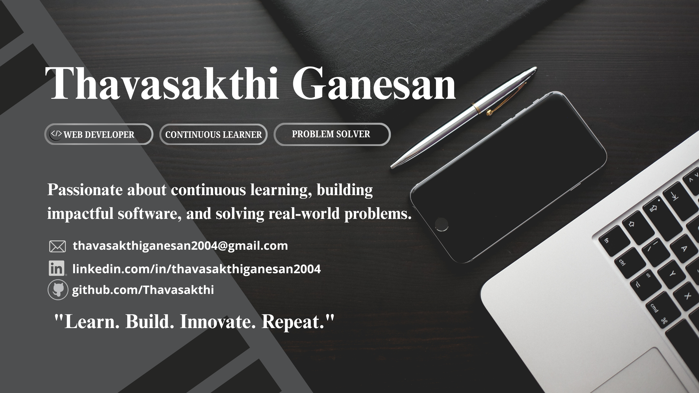

 

## About Me

I'm a Computer Science Engineering graduate (2022–2026) currently interning as a **MERN Stack Developer** at Tarcin Robotics. I build full-stack web applications with a focus on secure authentication (JWT, 2FA, RBAC), clean REST API design, and scalable architecture — with a strong foundation in DSA, OOP, and DBMS.

**Career Objective:** Software Developer role where I can build scalable applications using Java, React.js, Node.js, MySQL, and MongoDB, and contribute to solving real engineering problems.

---

## Tech Stack

| Category | Technologies |
|:--|:--|
| **Frontend** |  |
| **Backend** |  |
| **Database** |  |
| **Languages** |  |
| **Tools** |  |
| **Cloud** |  |
| **Currently Learning** |  Backend Architecture · REST API Best Practices · Java DSA |

---

## Featured Projects

| Project | Description | Tech Stack |
|:--|:--|:--|
| **[VeloDrive – Cloud Storage & Real-Time CDN Platform](https://github.com/Thavasakthi/VeloDrive)** | Full-stack cloud storage platform with secure file uploads, JWT auth, TOTP-based 2FA, RBAC, and real-time collaboration. | React 19, Vite 7, Node.js, Express.js, MongoDB Atlas, Socket.IO, JWT |
| **Institution Intelligence Engine** | Full-stack analytics platform for academic and placement data management with automated reporting. | Flask, MongoDB, REST APIs |
| **Student Skill Evaluation Platform** | Secure online assessment system with authentication, automated scoring, and result generation. | HTML, CSS, JavaScript, Node.js, MySQL |

---

## Experience

**MERN Stack Intern — Tarcin Robotics** · *Feb 2026 – Present*
- Built responsive React.js components and integrated REST APIs
- Handled MongoDB database operations and data modeling
- Collaborated using Git/GitHub in a team workflow
- Assisted with testing, debugging, and performance optimization

**Web Development Intern — Hazzino Technologies** · *Jun 2025 – Jul 2025*
- Built responsive web pages using HTML, CSS, and JavaScript
- Performed MySQL CRUD operations for dynamic data handling
- Used Git for version control and collaborative development
- Tested and debugged applications to improve reliability

---

## GitHub Stats

### Trophies

---

## Let's Connect

---

**Thanks for visiting!** Building modern web applications while continuously learning new technologies.

